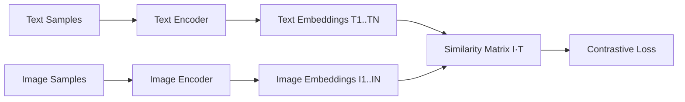
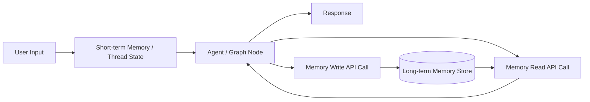
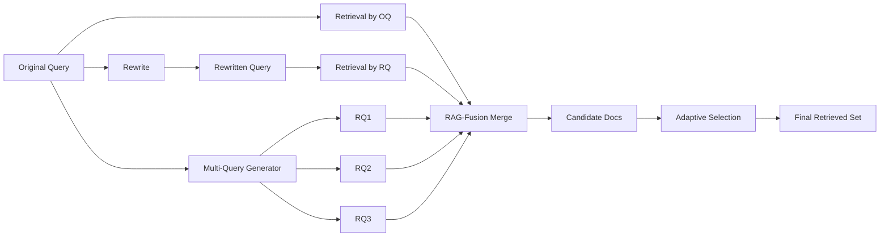
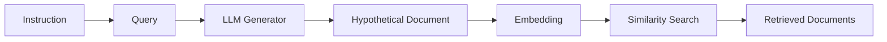
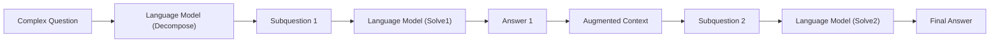
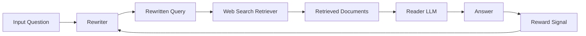
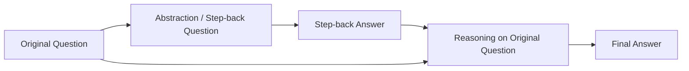
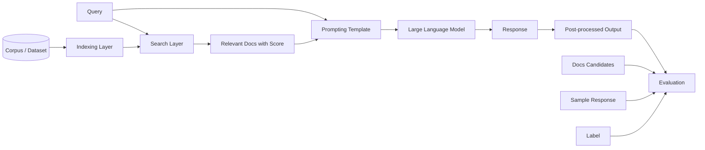

# Image Structure Graphs

- source_index: `plans/codex/image-arch/index.txt`
- ver: `v1.3.0`
- note: `02`는 원본 URL이 리다이렉트되어 이미지가 아닌 HTML이 내려와, 동일 개념(Short vs Long memory)으로 복원함.

## Document Map

| 문서 | 역할 |
|------|------|
| [PLAN.md](PLAN.md) | 실행 계획 · 에이전트 트랙 — 각 다이어그램의 담당 에이전트 확인 |
| [RAG_URL_KNOWLEDGE_BASE.md](../codex/docs/knowledge/RAG_URL_KNOWLEDGE_BASE.md) | 다이어그램 원본 논문 + 참고 URL |
| `IMAGE_STRUCTURE_GRAPHS.md` (이 파일) | 8개 다이어그램 Mermaid 코드 + adjacency_list |
| [IMAGE_URL_MATCHES.md](IMAGE_URL_MATCHES.md) | 이미지 URL ↔ 노트북/KB 소스 매핑 |

**다이어그램 빠른 탐색:**
[#01 CLIP](#01-clip-contrastive-pre-training) · [#02 Memory](#02-short-vs-long-memory-recovered) · [#03 Multi-Query](#03-multi-query--rag-fusion--dmqr-rag) · [#04 HyDE](#04-hyde) · [#05 Query Decomp](#05-query-decomposition) · [#06 Query Rewrite](#06-query-rewrite-trainable-rewrite-retrieve-read) · [#07 Step-back](#07-step-back-prompting) · [#08 RAG Eval](#08-rag-evaluationbenchmark-pipeline)

## 01. CLIP Contrastive Pre-training
- image_url: `https://greeksharifa.github.io/public/img/2021-12-19-CLIP/01a.png`
- cross_ref: 노트북 `LLM_029_Multimodal_LangChain_CLIP.ipynb` · `LLM_031_Multimodal_RAG_Part1.ipynb` · 에이전트 [A06 멀티모달 트랙](PLAN.md#8-agent-operation-plan) · 이미지 출처 [IMAGE_URL_MATCHES.md](IMAGE_URL_MATCHES.md#matched-with-rag_url_knowledge_base)

- adjacency_list:
  - `Text Samples -> [Text Encoder]`
  - `Image Samples -> [Image Encoder]`
  - `Text Encoder -> [Text Embeddings]`
  - `Image Encoder -> [Image Embeddings]`
  - `Text Embeddings -> [Similarity Matrix]`
  - `Image Embeddings -> [Similarity Matrix]`
  - `Similarity Matrix -> [Contrastive Loss]`

## 02. Short vs Long Memory (Recovered)
- image_url: `https://langchain-ai.github.io/langgraph/concepts/img/memory/short-vs-long.png`
- cross_ref: 노트북 `LLM_022_LangGraph_Memory.ipynb` · 에이전트 [A04 LangGraph/Memory 트랙](PLAN.md#8-agent-operation-plan) · 이미지 출처 [IMAGE_URL_MATCHES.md](IMAGE_URL_MATCHES.md#matched-with-rag_url_knowledge_base)

- adjacency_list:
  - `User Input -> [Short-term Memory]`
  - `Short-term Memory -> [Agent]`
  - `Agent -> [Response, Memory Write API Call, Memory Read API Call]`
  - `Memory Write API Call -> [Long-term Memory Store]`  # write path: Agent → WAPI → LTM
  - `Long-term Memory Store -> [Memory Read API Call]`   # read path: LTM → RAPI → Agent (독립 경로, write와 순서 무관)
  - `Memory Read API Call -> [Agent]`

## 03. Multi-Query / RAG-Fusion / DMQR-RAG
- image_url: `https://raw.githubusercontent.com/tsdata/image_files/main/202505/multi-query.png`
- cross_ref: 논문 [#05 DMQR-RAG](../codex/docs/knowledge/RAG_URL_KNOWLEDGE_BASE.md#paper-like-urls) · 노트북 `LLM_011_Query_Expansion.ipynb` · 에이전트 [A01 Query expansion 트랙](PLAN.md#8-agent-operation-plan) · 실행 단계 [Phase 3](PLAN.md#execution-phases) · 이미지 출처 [IMAGE_URL_MATCHES.md](IMAGE_URL_MATCHES.md#matched-with-rag_url_knowledge_base)
- taxonomy: [[쿼리 확장 검색]] · Axis A

- adjacency_list:
  - `Original Query -> [Retrieval by OQ, Rewrite, Multi-Query Generator]`
  - `Rewrite -> [Rewritten Query]`
  - `Rewritten Query -> [Retrieval by RQ]`
  - `Multi-Query Generator -> [RQ1, RQ2, RQ3]`
  - `Retrieval by OQ -> [RAG-Fusion Merge]`
  - `Retrieval by RQ -> [RAG-Fusion Merge]`
  - `RQ1 -> [RAG-Fusion Merge]`
  - `RQ2 -> [RAG-Fusion Merge]`
  - `RQ3 -> [RAG-Fusion Merge]`
  - `RAG-Fusion Merge -> [Candidate Docs]`
  - `Candidate Docs -> [Adaptive Selection]`
  - `Adaptive Selection -> [Final Retrieved Set]`

## 04. HyDE
- image_url: `https://raw.githubusercontent.com/tsdata/image_files/main/202505/query_HyDE.png`
- cross_ref: 논문 [#01 HyDE (2212.10496)](../codex/docs/knowledge/RAG_URL_KNOWLEDGE_BASE.md#paper-like-urls) · 노트북 `LLM_011_Query_Expansion.ipynb` · 에이전트 [A01 Query expansion 트랙](PLAN.md#8-agent-operation-plan) · 실행 단계 [Phase 3](PLAN.md#execution-phases) · 이미지 출처 [IMAGE_URL_MATCHES.md](IMAGE_URL_MATCHES.md#matched-with-rag_url_knowledge_base)
- taxonomy: [[쿼리 확장 검색]] · Axis A

- adjacency_list:
  - `Instruction -> [Query]`
  - `Query -> [LLM Generator]`
  - `LLM Generator -> [Hypothetical Document]`
  - `Hypothetical Document -> [Embedding]`
  - `Embedding -> [Similarity Search]`
  - `Similarity Search -> [Retrieved Documents]`
- note: HyDE 핵심 — 쿼리 임베딩이 아닌 가상 문서 임베딩(v_hypo)만으로 코퍼스를 검색함. Similarity Search가 곧 retrieval 결과이므로 별도 Retriever 노드 불필요.

## 05. Query Decomposition
- image_url: `https://raw.githubusercontent.com/tsdata/image_files/main/202505/query_decomposition.png`
- cross_ref: 노트북 `LLM_011_Query_Expansion.ipynb` · 에이전트 [A01 Query expansion 트랙](PLAN.md#8-agent-operation-plan) · 실행 단계 [Phase 3](PLAN.md#execution-phases) · 이미지 출처 [IMAGE_URL_MATCHES.md](IMAGE_URL_MATCHES.md#matched-with-rag_url_knowledge_base)
- taxonomy: [[쿼리 분해 프롬프팅]] · Axis A

- adjacency_list:
  - `Complex Question -> [Language Model(Decompose)]`
  - `Language Model(Decompose) -> [Subquestion 1]`
  - `Subquestion 1 -> [Language Model(Solve1)]`
  - `Language Model(Solve1) -> [Answer 1]`
  - `Answer 1 -> [Augmented Context]`
  - `Augmented Context -> [Subquestion 2]`
  - `Subquestion 2 -> [Language Model(Solve2)]`
  - `Language Model(Solve2) -> [Final Answer]`

## 06. Query Rewrite (Trainable Rewrite-Retrieve-Read)
- image_url: `https://raw.githubusercontent.com/tsdata/image_files/main/202505/query_rewrite.png`
- cross_ref: 노트북 `LLM_011_Query_Expansion.ipynb` · 에이전트 [A01 Query expansion 트랙](PLAN.md#8-agent-operation-plan) · 실행 단계 [Phase 3](PLAN.md#execution-phases) · 이미지 출처 [IMAGE_URL_MATCHES.md](IMAGE_URL_MATCHES.md#matched-with-rag_url_knowledge_base)
- taxonomy: [[쿼리 재작성]] · Axis A

- adjacency_list:
  - `Input Question -> [Rewriter]`
  - `Rewriter -> [Rewritten Query]`
  - `Rewritten Query -> [Web Search Retriever]`
  - `Web Search Retriever -> [Retrieved Documents]`
  - `Retrieved Documents -> [Reader LLM]`
  - `Reader LLM -> [Answer]`
  - `Answer -> [Reward Signal]`
  - `Reward Signal -> [Rewriter]`

## 07. Step-back Prompting
- image_url: `https://raw.githubusercontent.com/tsdata/image_files/main/202505/query_stepback.png`
- cross_ref: 노트북 `LLM_011_Query_Expansion.ipynb` · 에이전트 [A01 Query expansion 트랙](PLAN.md#8-agent-operation-plan) · 실행 단계 [Phase 3](PLAN.md#execution-phases) · 이미지 출처 [IMAGE_URL_MATCHES.md](IMAGE_URL_MATCHES.md#matched-with-rag_url_knowledge_base)
- taxonomy: [[쿼리 확장 검색]] · Axis A

- adjacency_list:
  - `Original Question -> [Abstraction/Step-back Question, Reasoning]`
  - `Abstraction/Step-back Question -> [Step-back Answer]`
  - `Step-back Answer -> [Reasoning]`
  - `Reasoning -> [Final Answer]`

## 08. RAG Evaluation/Benchmark Pipeline
- image_url: `https://raw.githubusercontent.com/tsdata/image_files/main/202505/rag_evaluation.png`
- cross_ref: 논문 [#04 RAG Survey (2405.07437)](../codex/docs/knowledge/RAG_URL_KNOWLEDGE_BASE.md#paper-like-urls) · 노트북 `LLM_008_RAG_Evalution.ipynb` · 에이전트 [A02 Evaluation 트랙](PLAN.md#8-agent-operation-plan) · 실행 단계 [Phase 2](PLAN.md#execution-phases) · 이미지 출처 [IMAGE_URL_MATCHES.md](IMAGE_URL_MATCHES.md#matched-with-rag_url_knowledge_base)
- taxonomy: [[RAG 평가 파이프라인]]

- adjacency_list:
  - `Dataset -> [Indexing Layer]`
  - `Indexing Layer -> [Search Layer]`
  - `Query -> [Search Layer, Prompting Template]`
  - `Search Layer -> [Relevant Docs with Score]`
  - `Relevant Docs with Score -> [Prompting Template]`
  - `Prompting Template -> [LLM]`
  - `LLM -> [Response]`
  - `Response -> [Post-processed Output]`
  - `Post-processed Output -> [Evaluation]`
  - `Ground Truth (Docs/Response/Label) -> [Evaluation]`
